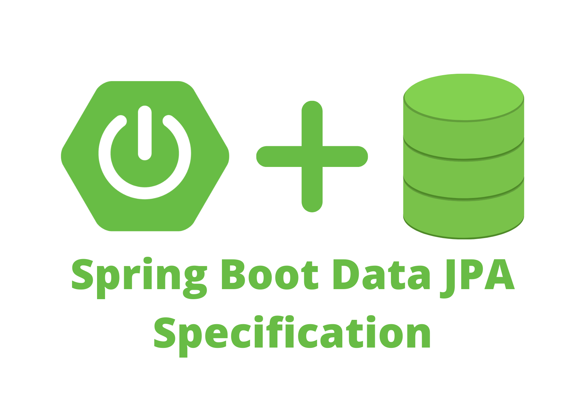
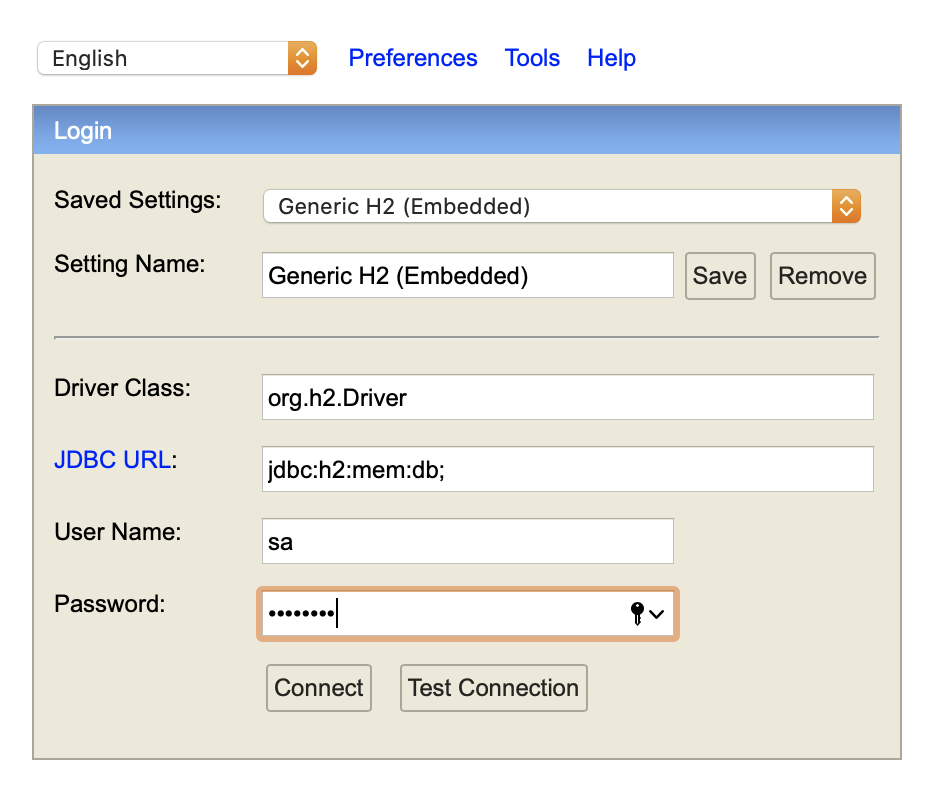
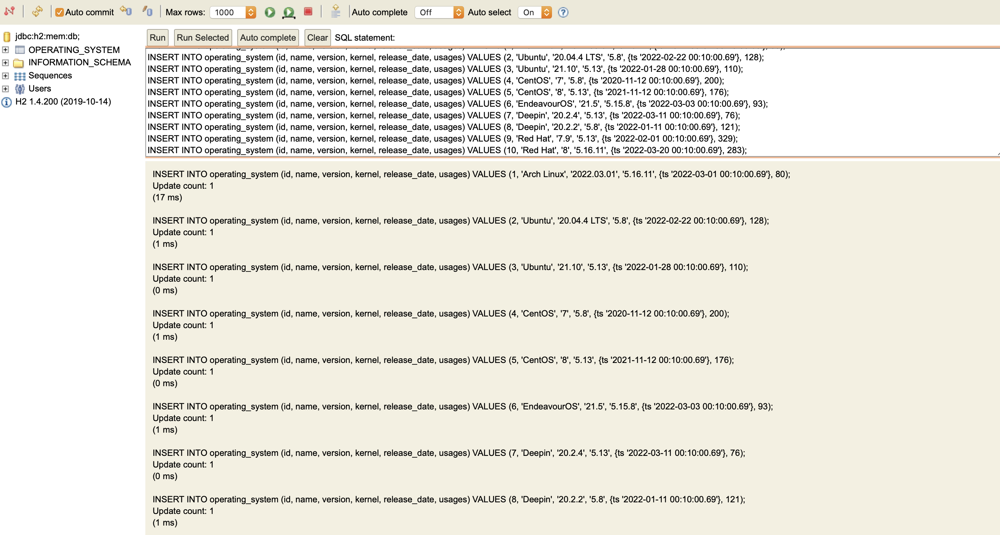

# Pesquisando e filtrando usando a especificação JPA

### Introdução



O Spring data JPA fornece muitas maneiras de lidar com entidades, incluindo métodos de consulta e consultas JPQL customizadas. No entanto, às vezes precisamos de uma abordagem mais programática: por exemplo, Criteria API ou QueryDSL.

A Especificação Spring Data JPA fornece uma maneira conveniente e sofisticada de construir cláusulas where de SQL dinâmico. Adicionando alguma lógica extra e considerando algumas armadilhas, somos capazes de oferecer aos consumidores de API um mecanismo genérico de esforço zero para filtrar entidades.

As especificações são construídas sobre a Criteria API para simplificar a experiência do desenvolvedor. Ao construir uma consulta Criteria, somos obrigados a construir e gerenciar objetos `Root`, `Criteria Query` e `Criteria Builder` por nós mesmos.

### Configuração e dependência do projeto

Dependência [Spring Initializr](https://start.spring.io/).

Adicionar `spring-boot-starter-data-jpa`, `spring-boot-starter-web`, `lombok` e `h2database`. No `pom.xml`.

```xml
<dependency>
  <groupId>org.springframework.boot</groupId>
  <artifactId>spring-boot-starter-data-jpa</artifactId>
</dependency>
<dependency>
  <groupId>org.springframework.boot</groupId>
  <artifactId>spring-boot-starter-web</artifactId>
</dependency>
<dependency>
  <groupId>com.h2database</groupId>
  <artifactId>h2</artifactId>
  <scope>runtime</scope>
</dependency>
<dependency>
  <groupId>org.projectlombok</groupId>
  <artifactId>lombok</artifactId>
  <optional>true</optional>
</dependency>
<dependency>
  <groupId>org.springframework.boot</groupId>
  <artifactId>spring-boot-starter-test</artifactId>
  <scope>test</scope>
</dependency>
```

Adicione o arquivo `application.properties` de configuração conforme abaixo.

```sh
server.port=8080
spring.application.name=search-request
server.servlet.context-path=/api

spring.datasource.url=jdbc:h2:mem:db;
spring.datasource.driverClassName=org.h2.Driver
spring.datasource.username=sa
spring.datasource.password=password
spring.jpa.database-platform=org.hibernate.dialect.H2Dialect
spring.h2.console.enabled=true
spring.jpa.show-sql=true
spring.jpa.hibernate.ddl-auto=update
```

### Implementação

Para simplificar, nos exemplos, implementaremos a mesma consulta de várias maneiras: localizando o sistema operacional pelo nome, o nome contendo String, data de lançamento entre data e versão do kernel em valores.

#### Table

Neste caso, utilizarei a tabela `operating_system` para simular os dados a serem desenvolvidos.

| Field | Type |
|---|---|
| **id** | INT (*Primary Key*) |
| name | VARCHAR(255) |
| version | VARCHAR(255) |
| kernel | VARCHAR(255) |
| release_date | TIMESTAMP |
| usages | INT |

#### Domain Data Access Object (DAO)

Criar `OperatingSystem` para Entidade como abaixo.

```java
@Data
@Builder
@NoArgsConstructor
@AllArgsConstructor
@Entity
@Table(name = "operating_system")
public class OperatingSystem implements Serializable {

    private static final long serialVersionUID = -1730538653948604611L;

    @Id
    @GeneratedValue(strategy = GenerationType.IDENTITY)
    private Long id;

    @Column(name = "name", nullable = false)
    private String name;

    @Column(name = "version", nullable = false)
    private String version;

    @Column(name = "kernel", nullable = false)
    private String kernel;

    @Column(name = "release_date", nullable = false)
    private LocalDateTime releaseDate;

    @Column(name = "usages", nullable = false)
    private Integer usages;
    
}
```

#### Filtrar Usando Especificação

**Enumeration of Field Type**

Vamos definir enum do tipo de campo que pode ser usado para analisar o tipo de dados. Então, podemos analisar o valor em `BOOLEAN`, `CHAR`, `DATE`, `DOUBLE`, `INTEGER`, `LONG`, and `STRING`.

```java
@Slf4j
public enum FieldType {

    BOOLEAN {
        public Object parse(String value) {
            return Boolean.valueOf(value);
        }
    },

    CHAR {
        public Object parse(String value) {
            return value.charAt(0);
        }
    },

    DATE {
        public Object parse(String value) {
            Object date = null;
            try {
                DateTimeFormatter formatter = DateTimeFormatter.ofPattern("dd-MM-yyyy HH:mm:ss");
                date = LocalDateTime.parse(value, formatter);
            } catch (Exception e) {
                log.info("Failed parse field type DATE {}", e.getMessage());
            }

            return date;
        }
    },

    DOUBLE {
        public Object parse(String value) {
            return Double.valueOf(value);
        }
    },

    INTEGER {
        public Object parse(String value) {
            return Integer.valueOf(value);
        }
    },

    LONG {
        public Object parse(String value) {
            return Long.valueOf(value);
        }
    },

    STRING {
        public Object parse(String value) {
            return value;
        }
    };

    public abstract Object parse(String value);

}
```

**Solicitação de filtro**

Um contrato de dados para solicitação de filtro deve ter um `key`, `operator`, `value` and `fieldType`.

```java
@Data
@Builder
@NoArgsConstructor
@AllArgsConstructor
@JsonIgnoreProperties(ignoreUnknown = true)
@JsonNaming(PropertyNamingStrategies.SnakeCaseStrategy.class)
public class FilterRequest implements Serializable {

    private static final long serialVersionUID = 6293344849078612450L;

    private String key;

    private Operator operator;

    private FieldType fieldType;

    private transient Object value;

    private transient Object valueTo;

    private transient List<Object> values;

}
```

**Enumeração do Operador**

Lógica para o predicate do Criteria API likes `EQUAL`, `NOT_EQUAL`, `LIKE`, `IN`, and `BETWEEN`.

```java
@Slf4j
public enum Operator {

    EQUAL {
        public <T> Predicate build(Root<T> root, CriteriaBuilder cb, FilterRequest request, Predicate predicate) {
            Object value = request.getFieldType().parse(request.getValue().toString());
            Expression<?> key = root.get(request.getKey());
            return cb.and(cb.equal(key, value), predicate);
        }
    },

    NOT_EQUAL {
        public <T> Predicate build(Root<T> root, CriteriaBuilder cb, FilterRequest request, Predicate predicate) {
            Object value = request.getFieldType().parse(request.getValue().toString());
            Expression<?> key = root.get(request.getKey());
            return cb.and(cb.notEqual(key, value), predicate);
        }
    },

    LIKE {
        public <T> Predicate build(Root<T> root, CriteriaBuilder cb, FilterRequest request, Predicate predicate) {
            Expression<String> key = root.get(request.getKey());
            return cb.and(cb.like(cb.upper(key), "%" + request.getValue().toString().toUpperCase() + "%"), predicate);
        }
    },

    IN {
        public <T> Predicate build(Root<T> root, CriteriaBuilder cb, FilterRequest request, Predicate predicate) {
            List<Object> values = request.getValues();
            CriteriaBuilder.In<Object> inClause = cb.in(root.get(request.getKey()));
            for (Object value : values) {
                inClause.value(request.getFieldType().parse(value.toString()));
            }
            return cb.and(inClause, predicate);
        }
    },

    BETWEEN {
        public <T> Predicate build(Root<T> root, CriteriaBuilder cb, FilterRequest request, Predicate predicate) {
            Object value = request.getFieldType().parse(request.getValue().toString());
            Object valueTo = request.getFieldType().parse(request.getValueTo().toString());
            if (request.getFieldType() == FieldType.DATE) {
                LocalDateTime startDate = (LocalDateTime) value;
                LocalDateTime endDate = (LocalDateTime) valueTo;
                Expression<LocalDateTime> key = root.get(request.getKey());
                return cb.and(cb.and(cb.greaterThanOrEqualTo(key, startDate), cb.lessThanOrEqualTo(key, endDate)), predicate);
            }

            if (request.getFieldType() != FieldType.CHAR && request.getFieldType() != FieldType.BOOLEAN) {
                Number start = (Number) value;
                Number end = (Number) valueTo;
                Expression<Number> key = root.get(request.getKey());
                return cb.and(cb.and(cb.ge(key, start), cb.le(key, end)), predicate);
            }

            log.info("Can not use between for {} field type.", request.getFieldType());
            return predicate;
        }
    };

    public abstract <T> Predicate build(Root<T> root, CriteriaBuilder cb, FilterRequest request, Predicate predicate);

}
```

Se eu mapear o operador traduzido para ser uma consulta sql como a tabela abaixo.

| Operator | SQL Query |
|---|---|
| EQUAL | `SELECT * FROM table WHERE field = ?` |
| NOT_EQUAL | `SELECT * FROM table WHERE field != ?` |
| LIKE | `SELECT * FROM table WHERE field LIKE '%?%'` |
| IN | `SELECT * FROM table WHERE field IN (?)` |
| BETWEEN | `SELECT * FROM table WHERE field >= ? AND field <= ?` |

**Enumeração de Sorting Direction**

Isso é usado quando precisamos classificar a consulta de resultado. Pode ser sentido ascendente ou descendente.

```java
public enum SortDirection {

    ASC {
        public <T> Order build(Root<T> root, CriteriaBuilder cb, SortRequest request) {
            return cb.asc(root.get(request.getKey()));
        }
    },
    DESC {
        public <T> Order build(Root<T> root, CriteriaBuilder cb, SortRequest request) {
            return cb.desc(root.get(request.getKey()));
        }
    };

    public abstract <T> Order build(Root<T> root, CriteriaBuilder cb, SortRequest request);

}
```

Se eu mapear a direção de classificação traduzida para ser uma consulta SQL como a tabela abaixo.

| Direction | SQL Query |
|---|---|
| ASC | `SELECT * FROM table ORDER BY field ASC` |
| DESC | `SELECT * FROM table ORDER BY field DESC` |

**Sort Request**

Um contrato de dados para solicitação de classificação deve conter uma `key` e `direction`.

```java
@Data
@Builder
@NoArgsConstructor
@AllArgsConstructor
@JsonIgnoreProperties(ignoreUnknown = true)
@JsonNaming(PropertyNamingStrategies.SnakeCaseStrategy.class)
public class SortRequest implements Serializable {

    private static final long serialVersionUID = 3194362295851723069L;

    private String key;

    private SortDirection direction;

}
```

**Search Request**

Esta é uma solicitação principal que deve ser usada na REST API.

```java
@Data
@Builder
@NoArgsConstructor
@AllArgsConstructor
@JsonIgnoreProperties(ignoreUnknown = true)
@JsonNaming(PropertyNamingStrategies.SnakeCaseStrategy.class)
public class SearchRequest implements Serializable {

    private static final long serialVersionUID = 8514625832019794838L;

    private List<FilterRequest> filters;

    private List<SortRequest> sorts;

    private Integer page;

    private Integer size;

    public List<FilterRequest> getFilters() {
        if (Objects.isNull(this.filters)) return new ArrayList<>();
        return this.filters;
    }

    public List<SortRequest> getSorts() {
        if (Objects.isNull(this.sorts)) return new ArrayList<>();
        return this.sorts;
    }

}
```

**Generic Class Search Specification**

Por último, criaremos uma classe genérica que implementa a interface Specification e passaremos em nossa própria restrição para construir a consulta real.

```java
@Slf4j
@AllArgsConstructor
public class SearchSpecification<T> implements Specification<T> {

    private static final long serialVersionUID = -9153865343320750644L;

    private final transient SearchRequest request;

    @Override
    public Predicate toPredicate(Root<T> root, CriteriaQuery<?> query, CriteriaBuilder cb) {
        Predicate predicate = cb.equal(cb.literal(Boolean.TRUE), Boolean.TRUE);

        for (FilterRequest filter : this.request.getFilters()) {
            log.info("Filter: {} {} {}", filter.getKey(), filter.getOperator().toString(), filter.getValue());
            predicate = filter.getOperator().build(root, cb, filter, predicate);
        }

        List<Order> orders = new ArrayList<>();
        for (SortRequest sort : this.request.getSorts()) {
            orders.add(sort.getDirection().build(root, cb, sort));
        }

        query.orderBy(orders);
        return predicate;
    }

    public static Pageable getPageable(Integer page, Integer size) {
        return PageRequest.of(Objects.requireNonNullElse(page, 0), Objects.requireNonNullElse(size, 100));
    }

}
```

#### Usando Especificação de Pesquisa

**Repository**

Em seguida, crie o repositório e estenda o `JPASpecificationExecutor` para obter as novas APIs de especificação.

```java
@Repository
public interface OperatingSystemRepository extends JpaRepository<OperatingSystem, Long>,
        JpaSpecificationExecutor<OperatingSystem> {
}
```

**Service and Controller**

Create service to construct and build specification also pagination request into repository.

```java
@Slf4j
@Service
public class OperatingSystemService {

    @Autowired
    private OperatingSystemRepository operatingSystemRepository;

    public Page<OperatingSystem> searchOperatingSystem(SearchRequest request) {
        SearchSpecification<OperatingSystem> specification = new SearchSpecification<>(request);
        Pageable pageable = SearchSpecification.getPageable(request.getPage(), request.getSize());
        return operatingSystemRepository.findAll(specification, pageable);
    }

}
```

Create controller to receive of search request from REST.

```java
@Slf4j
@RestController
@RequestMapping(value = "/operating-system", consumes = MediaType.APPLICATION_JSON_VALUE, produces = MediaType.APPLICATION_JSON_VALUE)
public class OperatingSystemController {

    @Autowired
    private OperatingSystemService operatingSystemService;

    @PostMapping(value = "/search")
    public Page<OperatingSystem> search(@RequestBody SearchRequest request) {
        return operatingSystemService.searchOperatingSystem(request);
    }

}
```

#### Test Search Sepecification

Iniciar a aplicação -> `mvn spring-boot: run` e abrir no navegador `http://localhost:8080/api/h2-console`



Execute esta consulta para `h2-console`.

```sql
INSERT INTO operating_system (id, name, version, kernel, release_date, usages) VALUES (1, 'Arch Linux', '2022.03.01', '5.16.11', {ts '2022-03-01 00:10:00.69'}, 80);
INSERT INTO operating_system (id, name, version, kernel, release_date, usages) VALUES (2, 'Ubuntu', '20.04.4 LTS', '5.8', {ts '2022-02-22 00:10:00.69'}, 128);
INSERT INTO operating_system (id, name, version, kernel, release_date, usages) VALUES (3, 'Ubuntu', '21.10', '5.13', {ts '2022-01-28 00:10:00.69'}, 110);
INSERT INTO operating_system (id, name, version, kernel, release_date, usages) VALUES (4, 'CentOS', '7', '5.8', {ts '2020-11-12 00:10:00.69'}, 200);
INSERT INTO operating_system (id, name, version, kernel, release_date, usages) VALUES (5, 'CentOS', '8', '5.13', {ts '2021-11-12 00:10:00.69'}, 176);
INSERT INTO operating_system (id, name, version, kernel, release_date, usages) VALUES (6, 'EndeavourOS', '21.5', '5.15.8', {ts '2022-03-03 00:10:00.69'}, 93);
INSERT INTO operating_system (id, name, version, kernel, release_date, usages) VALUES (7, 'Deepin', '20.2.4', '5.13', {ts '2022-03-11 00:10:00.69'}, 76);
INSERT INTO operating_system (id, name, version, kernel, release_date, usages) VALUES (8, 'Deepin', '20.2.2', '5.8', {ts '2022-01-11 00:10:00.69'}, 121);
INSERT INTO operating_system (id, name, version, kernel, release_date, usages) VALUES (9, 'Red Hat', '7.9', '5.13', {ts '2022-02-01 00:10:00.69'}, 329);
INSERT INTO operating_system (id, name, version, kernel, release_date, usages) VALUES (10, 'Red Hat', '8', '5.16.11', {ts '2022-03-20 00:10:00.69'}, 283);
```



**Without Filter and Sorting**

```json
{
    "filters": [],
    "sorts": [],
    "page": null,
    "size": null
}
```

**Filter by Name and Sort by Release Date ASC**

Filter name equal to CentOS

```json
{
    "filters": [
        {
            "key": "name",
            "operator": "EQUAL",
            "field_type": "STRING",
            "value": "CentOS"
        }
    ],
    "sorts": [
        {
            "key": "releaseDate",
            "direction": "ASC"
        }
    ],
    "page": null,
    "size": null
}
```

Filter name not equal to CentOS

```json
{
    "filters": [
        {
            "key": "name",
            "operator": "NOT_EQUAL",
            "field_type": "STRING",
            "value": "CentOS"
        }
    ],
    "sorts": [
        {
            "key": "releaseDate",
            "direction": "ASC"
        }
    ],
    "page": null,
    "size": null
}
```

Filter name not equal to CentOS and size 1 response

```json
{
    "filters": [
        {
            "key": "name",
            "operator": "NOT_EQUAL",
            "field_type": "STRING",
            "value": "CentOS"
        }
    ],
    "sorts": [
        {
            "key": "releaseDate",
            "direction": "ASC"
        }
    ],
    "page": null,
    "size": 1
}
```

**Filter name like and sort by release data DESC**

```json
{
    "filters": [
        {
            "key": "name",
            "operator": "LIKE",
            "field_type": "STRING",
            "value": "Red"
        }
    ],
    "sorts": [
        {
            "key": "releaseDate",
            "direction": "DESC"
        }
    ],
    "page": null,
    "size": null
}
```

**Filter kernel in**

```json
{
    "filters": [
        {
            "key": "kernel",
            "operator": "IN",
            "field_type": "STRING",
            "values": ["5.13", "5.8"]
        }
    ],
    "sorts": [],
    "page": null,
    "size": null
}
```

**Filter using between**

Filter release date

```json
{
    "filters": [
        {
            "key": "releaseDate",
            "operator": "BETWEEN",
            "field_type": "DATE",
            "value": "01-03-2022 00:00:00",
            "value_to": "11-03-2022 23:59:59"
        }
    ],
    "sorts": [],
    "page": null,
    "size": null
}
```

Filter usages

```json
{
    "filters": [
        {
            "key": "usages",
            "operator": "BETWEEN",
            "field_type": "INTEGER",
            "value": 100,
            "value_to": 250
        }
    ],
    "sorts": [],
    "page": null,
    "size": null
}
```

### Conclusão

As especificações JPA nos fornecem uma maneira de escrever consultas reutilizáveis e também APIs fluentes com as quais podemos combinar e criar consultas mais sofisticadas.

O problema de pesquisa e filtragem é trivial para todos os aplicativos modernos e a Especificação Spring Data JPA fornece uma maneira simples e elegante de criar consultas dinâmicas. Por favor, compartilhe seus pensamentos e sugestões sobre como você gostaria de resolver o problema de busca e filtragem.

A abstração do repositório JPA de dados Spring permite a execução de predicados por meio de predicados de API de critérios JPA agrupados em um objeto de especificação. Para habilitar essa funcionalidade, basta deixar seu repositório estender `JpaSpecificationExecutor`.


### Reference

- [Interface Specification<T>](https://docs.spring.io/spring-data/jpa/docs/current/api/org/springframework/data/jpa/domain/Specification.html)
- [Spring Data JPA: A Generic Specification Query Language](https://medium.com/geekculture/spring-data-jpa-a-generic-specification-query-language-a599aea84856)
- [Searching and Filtering: Spring Data JPA Specification way](https://medium.com/fleetx-engineering/searching-and-filtering-spring-data-jpa-specification-way-e22bc055229a)
- [Getting Started with Spring Data Specifications](https://reflectoring.io/spring-data-specifications/)
- [Use Criteria Queries in a Spring Data Application](https://www.baeldung.com/spring-data-criteria-queries)
- [REST Query Language with Spring Data JPA Specifications](https://www.baeldung.com/rest-api-search-language-spring-data-specifications)
- [Advanced Spring Data JPA - Specifications and Querydsl](https://spring.io/blog/2011/04/26/advanced-spring-data-jpa-specifications-and-querydsl/)
